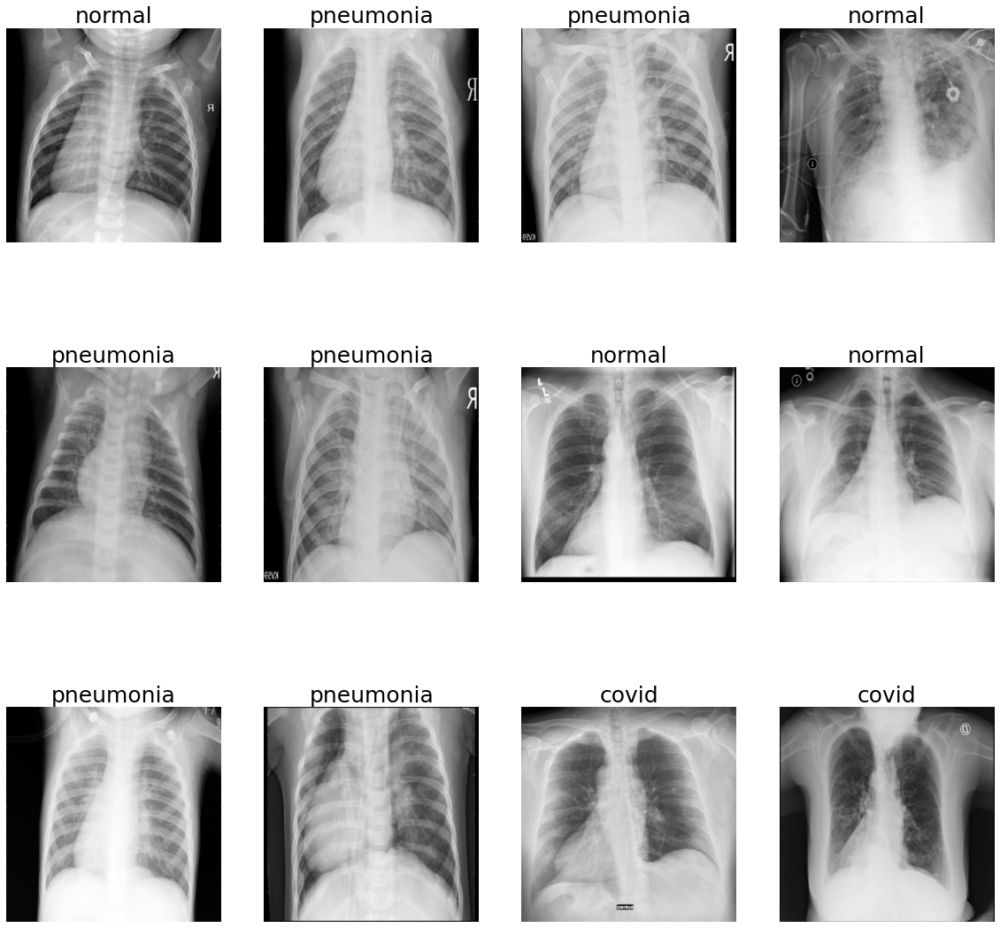
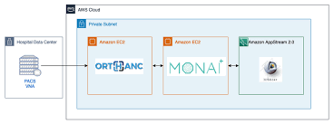

# Monai
<p align="center">
  
</p>

## 📌 مقدمه 
پیشرفت‌های اخیر در یادگیری عمیق، تحول بزرگی در حوزه تصویربرداری پزشکی ایجاد کرده‌اند؛ از تشخیص خودکار بیماری‌ها تا تحلیل پیچیده داده‌های MRI و CT. با این حال، کار با داده‌های پزشکی به دلیل فرمت‌های خاص، نیازمندی‌های پردازشی بالا، و پیچیدگی مدل‌های مورد نیاز، چالش‌برانگیز است. فریم‌ورک MONAI، که بر پایه PyTorch ساخته شده، با هدف ساده‌سازی توسعه مدل‌های هوش مصنوعی در حوزه پزشکی طراحی شده است. این کتابخانه امکانات پیشرفته‌ای برای پردازش داده‌های تصویربرداری پزشکی، ساخت مدل‌های پیچیده (مانند UNet، DynUNet و SegResNet)، و آموزش در سطح صنعتی فراهم می‌کند.

## 📌 کاربردهای MONAI

فریم‌ورک MONAI (Medical Open Network for AI) با تمرکز بر تصویربرداری پزشکی، ابزارها و ماژول‌هایی فراهم می‌کند که توسعه مدل‌های یادگیری عمیق را در حوزه سلامت تسهیل می‌سازد. در این بخش، با مهم‌ترین کاربردهای MONAI در پروژه‌های واقعی آشنا می‌شوید، همراه با تصاویر و مثال‌های عملی از مخازن GitHub.

---

### 🧠 1. سگمنتیشن تصاویر پزشکی (Medical Image Segmentation)

📌 **توضیح:**  
سگمنتیشن فرآیندی است که در آن نواحی مشخصی از تصویر (مانند تومورها، اندام‌ها یا بافت‌ها) تفکیک و شناسایی می‌شوند. این فرآیند یکی از مهم‌ترین و رایج‌ترین کاربردهای یادگیری عمیق در پزشکی است. با استفاده از معماری‌هایی مانند `UNet`, `Swin UNETR`, و `DynUNet`، MONAI می‌تواند مدل‌هایی قدرتمند برای استخراج دقیق ساختارهای پزشکی از داده‌های حجیم مانند MRI یا CT ایجاد کند.

📚 **مثال‌ها:**
- 🧪 BraTS Challenge: سگمنت‌کردن تومور مغزی با Swin UNETR  
  🔗 [کد منبع در GitHub](https://github.com/Project-MONAI/tutorials/blob/main/3d_segmentation/swin_unetr_brats21_segmentation_3d.ipynb)
- 👨‍⚕️ پروژه شخصی برای سگمنت‌کردن کبد یا ریه با UNet  
  🔗 [نمونه ریپوزیتوری](https://github.com/jinunyachhyon/Medical-Image-Segmentation-using-MONAI)

🖼️ **نمونه تصویر:**
<p align="center">
  
</p>

---

### 🔍 2. طبقه‌بندی پزشکی (Medical Image Classification)

📌 **توضیح:**  
طبقه‌بندی تصاویر پزشکی به فرآیند تشخیص وجود یا عدم وجود بیماری‌ها در تصاویر (مانند CT یا X-ray) اشاره دارد. از کاربردهای رایج آن می‌توان به تشخیص COVID-19، سرطان پستان یا بیماری‌های ریوی اشاره کرد. MONAI از مدل‌هایی مانند `DenseNet`, `ResNet`, و `EfficientNet` برای طبقه‌بندی تصاویر پشتیبانی می‌کند. ابزارهای ساده‌ی آموزش و ارزیابی باعث می‌شود مدل‌های تشخیص بیماری در زمان کوتاه توسعه یابند.

📚 **مثال‌ها:**
- 🤒 تشخیص COVID-19 از CT قفسه سینه  
  🔗 [نمونه پروژه](https://github.com/Project-MONAI/tutorials/blob/main/modules/interpretability/covid_classification.ipynb)
- 🖼 آموزش مدل طبقه‌بندی با داده MedNIST  
  🔗 [آموزش در GitHub](https://github.com/Project-MONAI/tutorials/blob/master/2d_classification/mednist_tutorial.ipynb)

🖼️ **نمونه تصویر:**
<p align="center">
  
</p>

---

### 📏 3. ثبت تصاویر پزشکی (Image Registration)

📌 **توضیح:**  
ثبت تصاویر به معنای هم‌ترازی تصاویر پزشکی از زمان‌ها یا منابع مختلف است. این تکنیک برای مقایسه تصاویر قبل و بعد از درمان، ترکیب چند نوع modality (مثل CT و MRI)، یا حذف اثر حرکت بیمار کاربرد دارد. MONAI ابزارهایی برای ثبت تصاویر جفتی (supervised) و ثبت بدون نظارت (unsupervised) ارائه کرده که با استفاده از شبکه‌های کانولوشنی یا ترنسفورمر انجام می‌شود.

📚 **مثال‌ها:**
- 📦 ثبت تصاویر ریه در چند نوبت CT  
  🔗 [آموزش ثبت جفتی در GitHub](https://github.com/Project-MONAI/tutorials/blob/main/3d_registration/paired_lung_ct.ipynb)
- 🧠 ثبت بدون نظارت مغز با مجموعه داده OASIS  
  🔗 [کد آموزشی در GitHub](https://github.com/Project-MONAI/tutorials/blob/main/3d_registration/learn2reg_oasis_unpaired_brain_mr.ipynb)

🖼️ **نمونه تصویر:**
<p align="center">
  
</p>

---

### 🩻 4. بازسازی سه‌بعدی (3D Reconstruction)

📌 **توضیح:**  
در این کاربرد، هدف ایجاد نمای سه‌بعدی از اندام‌ها یا ساختارهای داخلی بدن بر اساس برش‌های دو‌بعدی (مانند CT/MRI slice) است. بازسازی سه‌بعدی در جراحی‌های پیچیده، مدلسازی دیجیتالی بیمار و شبیه‌سازی‌های درمانی اهمیت بالایی دارد. MONAI قابلیت‌هایی برای استفاده از VAE (Variational Autoencoder) و GAN برای این کاربرد فراهم کرده است.

📚 **مثال‌ها:**
- 📈 بازسازی تصاویر MedNIST با استفاده از VAE  
  🔗 [آموزش در GitHub](https://github.com/Project-MONAI/tutorials/blob/main/modules/varautoencoder_mednist.ipynb)

🖼️ **نمونه تصویر:**
<p align="center">
  
</p>

---

### ⚙️ 5. ساختار Pipeline کامل یادگیری ماشین پزشکی

📌 **توضیح:**  
یکی از ویژگی‌های برجسته MONAI، پشتیبانی از ساخت pipelineهای کامل از ابتدا تا انتهای پروژه است. این قابلیت شامل مراحل مختلفی است:
- بارگذاری و پردازش داده‌های پزشکی (DICOM, NIfTI)
- افزایش داده (data augmentation) اختصاصی پزشکی
- آموزش مدل با چند GPU و پشتیبانی از Mixed Precision
- ارزیابی با متریک‌های پزشکی (Dice, Hausdorff Distance)
- استقرار مدل با MONAI Deploy در سیستم‌های کلینیکی یا لبه‌ای (edge devices)

📚 **مثال‌ها:**
- 🏥 ساخت اپلیکیشن قابل استقرار با MONAI Deploy SDK  
  🔗 [مشاهده در GitHub](https://github.com/Project-MONAI/monai-deploy-app-sdk)
- ⚡ پردازش بلادرنگ با MONAIStream  
  🔗 [لینک به ریپوزیتوری](https://github.com/Project-MONAI/MONAIStream)

🖼️ **ساختار pipeline:**
<p align="center">
  
</p>

---

## 🚀 نصب و راه‌اندازی MONAI

فریم‌ورک MONAI برای پردازش داده‌های پزشکی طراحی شده و می‌تواند روی سیستم‌های محلی یا محیط‌هایی مانند Google Colab اجرا شود. در ادامه، مراحل نصب آن به‌صورت گام‌به‌گام آمده است.

---

### 🧰 پیش‌نیازها

| ابزار         | نسخه پیشنهادی     | توضیح                              |
|--------------|--------------------|-------------------------------------|
| Python        | 3.8 - 3.11         | توصیه به استفاده از 3.10 یا بالاتر |
| PyTorch       | 1.13 یا بالاتر     | MONAI بر پایه PyTorch توسعه داده شده است |
| CUDA          | 11.6 یا 11.8       | در صورت استفاده از GPU             |
| pip / conda   | آخرین نسخه        | برای نصب بسته‌ها                   |

---

### 🧱 مرحله ۱: ساخت محیط مجازی

#### ✅ گزینه ۱: استفاده از `venv`

```bash
python -m venv monai-env
source monai-env/bin/activate       # در Linux/macOS
monai-env\Scripts\activate          # در Windows
```
#### ✅ گزینه ۲: استفاده از `conda`
```bash
conda create -n monai-env python=3.10 -y
conda activate monai-env
```

### 📦 مرحله ۲: نصب MONAI

#### 📌 نسخه پایدار:
```bash
pip install monai
```
#### 📌 نسخه کامل همراه با کتابخانه‌های اضافی:
```bash
pip install "monai[all]"
```

### 🔥 مرحله ۳: نصب PyTorch (در صورت نیاز)

#### ⚡ نصب با پشتیبانی از CUDA 11.8 (برای GPU):
```bash 
pip install matplotlib nibabel scikit-image scikit-learn pandas tqdm jupyter
```
#### 💡 نصب نسخه CPU-only:
```bash
pip install torch torchvision torchaudio
```

### 🧩 مرحله ۴: نصب کتابخانه‌های مکمل (اختیاری اما مفید)

```bash
pip install matplotlib nibabel scikit-image scikit-learn pandas tqdm jupyter
```
#### ✅ مرحله ۵: بررسی صحت نصب

برای اطمینان از نصب صحیح MONAI:
```bash
import monai
print(monai.__version__)
```
اگر نسخه‌ی MONAI بدون خطا چاپ شد، نصب موفقیت‌آمیز بوده است.

### ☁️ مرحله ۶: اجرای سریع در Google Colab (بدون نصب)
اگر نمی‌خواهید MONAI را در سیستم خود نصب کنید، می‌توانید از Colab استفاده کنید:

🔗 [MedNIST Classification - Colab](https://colab.research.google.com/github/Project-MONAI/tutorials/blob/main/2d_classification/mednist_tutorial.ipynb)

🔗 [3D Brain Tumor Segmentation - Colab](https://colab.research.google.com/github/Project-MONAI/tutorials/blob/main/3d_segmentation/swin_unetr_brats21_segmentation_3d.ipynb)


### ℹ️ نکات مفید
- در صورت مشاهده خطای `CUDA not available`، نسخه مناسب PyTorch برای GPU را نصب کنید.
- پیشنهاد می‌شود برای پروژه‌های بزرگ از `conda` استفاده شود.
- می‌توانید با ابزارهایی مانند `nvidia-smi` بررسی کنید که آیا GPU سیستم شناسایی شده است یا نه.

## 🐳 اجرای MONAI با Docker Compose

اجرای MONAI در محیط ایزوله با Docker Compose راهی ساده برای راه‌اندازی سریع و قابل حمل است، مخصوصاً در محیط‌های تیمی یا سرورهای GPU محور.

---

### 📁 ساختار فایل‌ها
```text
project-folder/
├── Dockerfile
├── docker-compose.yml
└── README.md
```
💡 اگر از CPU-only استفاده می‌کنید، خطوط `runtime:` و `reservations:` را حذف کنید.

### 🚀  اجرای پروژه
برای ساخت ایمیج و اجرای سرویس:

```bash
docker-compose up --build
```
پس از اجرا، Jupyter Notebook در http://localhost:8888 در دسترس است.


### 📂  اشتراک‌گذاری فایل‌ها
دایرکتوری پروژه به‌صورت Volume به `/workspace` در کانتینر متصل شده است. هر تغییری در فایل‌ها بلافاصله در داخل کانتینر نیز قابل مشاهده است.

### 📌 نکات تکمیلی
  - برای اجرای کدهای MONAI می‌توانید از دایرکتوری `/workspace` استفاده کنید. 
  - با اضافه کردن فایل‌های `.ipynb` یا `.py` می‌توانید مستقیماً در Jupyter کار کنید.
  - می‌توانید برای توسعه، مدل‌ها، یا آموزش مدل‌ها از GPU سیستم خود بهره ببرید.


## 🏭 کاربردهای صنعتی MONAI

پروژه MONAI در بسیاری از پروژه‌های صنعتی و کاربردهای پزشکی دنیای واقعی مورد استفاده قرار گرفته است. در ادامه، برخی از مهم‌ترین کاربردهای آن در حوزه‌های بالینی و تجاری با جزئیات، منابع رسمی و رسانه‌های تصویری بررسی شده‌اند:

---

### 🧠 1. سگمنتیشن تومور مغزی در Mayo Clinic

مرکز هوش مصنوعی تصویربرداری (CAII) در بیمارستان Mayo Clinic از MONAI برای توسعه مدل‌های سگمنتیشن MRI در تشخیص تومورهای مغزی استفاده می‌کند. این مدل‌ها در گردش‌کارهای تشخیص بالینی ادغام شده‌اند و به پزشکان در تحلیل دقیق‌تر تصاویر کمک می‌کنند.

🔗 منبع: [MONAI x Mayo Clinic](https://monai.io/mayo-case-study.html)

📸 تصویر:
<p align="center">
  
</p>

---

### 🩺 2. برچسب‌گذاری هوشمند تصاویر CT در AWS Health

سازمان سلامت NSW Health در استرالیا از MONAI Label بر روی AWS برای تسریع فرآیند annotation تصاویر CT بیماران سکته مغزی استفاده کرده است. این ابزار با بهره‌گیری از یادگیری فعال، حجم کار نیروی انسانی را کاهش داده و دقت برچسب‌گذاری را افزایش می‌دهد.

🔗 منبع: [AI-assisted Annotation - AWS Blog](https://aws.amazon.com/blogs/industries/ai-assisted-annotation-of-medical-images-using-monai-label-on-aws/)

📸 تصویر:
<p align="center">
  
</p>

---

### 🧬 3. توسعه مدل‌های هوش مصنوعی در Mass General Brigham

این بیمارستان با همکاری NVIDIA از MONAI برای ایجاد یک گردش‌کار کامل توسعه تا استقرار مدل‌های تشخیصی استفاده کرده است. این زیرساخت به پزشکان اجازه می‌دهد مدل‌ها را مستقیماً وارد سامانه‌های PACS و تجهیزات تصویربرداری کنند.

🔗 منبع: [SiliconAngle - NVIDIA & Nuance](https://siliconangle.com/2022/11/16/nuance-nvidia-partner-improve-medical-imaging/)

---

### 🔁 4. استفاده از مدل‌های تولیدی (Generative Models)

کتابخانه MONAI Generative برای آموزش و ارزیابی مدل‌های تولیدی مانند Diffusion Models، GANها و Transformers در تصویربرداری پزشکی به‌کار می‌رود. این ابزار برای داده‌سازی مصنوعی، تقویت داده، یا بازسازی استفاده می‌شود.

🔗 مقاله: [arXiv:2307.15208](https://arxiv.org/abs/2307.15208)

---

### 🚀 5. استقرار مدل‌ها با MONAI Deploy

MONAI Deploy پلتفرمی است برای تبدیل مدل‌های آموزش‌دیده به بسته‌های آماده اجرا در بیمارستان‌ها و کلینیک‌ها. این بسته‌ها می‌توانند به‌طور خودکار به تجهیزات PACS، سیستم‌های DICOM و سایر ابزارهای درمانی متصل شوند.

🔗 منبع: [NVIDIA Blog - MONAI Deploy](https://developer.nvidia.com/blog/taking-ai-into-clinical-production-with-monai-deploy/)

📸 تصویر:
<p align="center">
  
</p>

---

### 🎥 ویدیو آموزشی رسمی

در این ویدیو رسمی، نحوه استفاده از PyTorch و MONAI برای آموزش مدل‌های یادگیری عمیق در تصویربرداری پزشکی آموزش داده می‌شود:

📺 لینک ویدیو: [Watch on YouTube](https://www.youtube.com/watch?v=M3ZWfamWrBM)

<p align="center">
  <a href="https://www.youtube.com/watch?v=M3ZWfamWrBM">
    
  </a>
</p>

---

> ⚠️ توجه: برای استفاده از GPU نیاز به نصب `nvidia-docker` و فعال‌سازی CUDA در محیط میزبان دارید.


