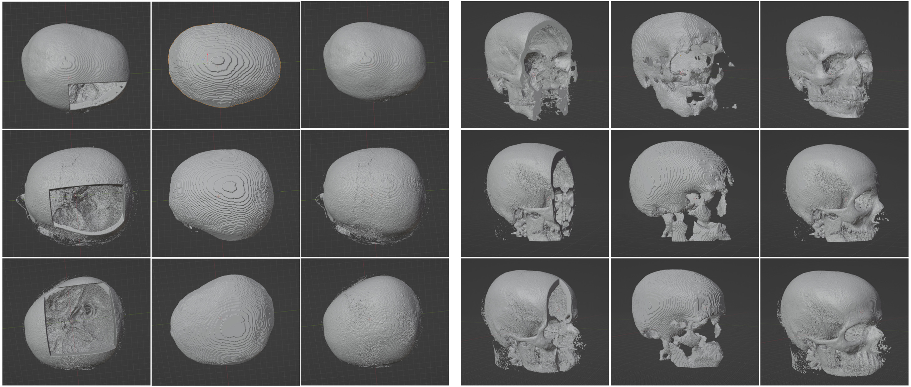

# Monai

  

## مقدمه 
پیشرفت‌های اخیر در یادگیری عمیق، تحول بزرگی در حوزه تصویربرداری پزشکی ایجاد کرده‌اند؛ از تشخیص خودکار بیماری‌ها تا تحلیل پیچیده داده‌های MRI و CT. با این حال، کار با داده‌های پزشکی به دلیل فرمت‌های خاص، نیازمندی‌های پردازشی بالا، و پیچیدگی مدل‌های مورد نیاز، چالش‌برانگیز است. فریم‌ورک MONAI، که بر پایه PyTorch ساخته شده، با هدف ساده‌سازی توسعه مدل‌های هوش مصنوعی در حوزه پزشکی طراحی شده است. این کتابخانه امکانات پیشرفته‌ای برای پردازش داده‌های تصویربرداری پزشکی، ساخت مدل‌های پیچیده (مانند UNet، DynUNet و SegResNet)، و آموزش در سطح صنعتی فراهم می‌کند.

## 📌 کاربردهای MONAI

فریم‌ورک MONAI ابزارهای تخصصی برای توسعه مدل‌های یادگیری عمیق در تصویربرداری پزشکی فراهم می‌کند. در ادامه، مهم‌ترین کاربردهای آن را با مثال و تصویر بررسی می‌کنیم:

---

### 🧠 1. سگمنتیشن تصاویر پزشکی (Medical Image Segmentation)

📌 مثال‌ها:
- استخراج تومور مغز از MRI (BraTS)
- سگمنت‌کردن ریه در CT اسکن

🖼️ نمونه سگمنتیشن:

  

---

### 🔍 2. طبقه‌بندی پزشکی (Medical Image Classification)

📌 مثال‌ها:
- تشخیص COVID-19 در CT قفسه سینه
- طبقه‌بندی سرطان از ماموگرافی

🖼️ نمونه طبقه‌بندی:

  

---

### 📏 3. ثبت تصاویر پزشکی (Image Registration)

📌 مثال‌ها:
- ثبت CT و MRI یک بیمار
- انطباق زمان‌دار اسکن‌ها

🖼️ نمونه ثبت تصویر:

  

---

### 🩻 4. بازسازی سه‌بعدی (3D Reconstruction)

📌 مثال‌ها:
- بازسازی ساختار مغز از تصاویر slice
- مدل‌سازی اندام‌ها

🖼️ بازسازی 3D:

  

---

### ⚙️ 5. Pipelineهای کامل یادگیری ماشین پزشکی

📌 امکانات:
- Transforms پیشرفته
- آموزش توزیع‌شده
- ابزار ارزیابی پزشکی

🖼️ ساختار pipeline:

  

